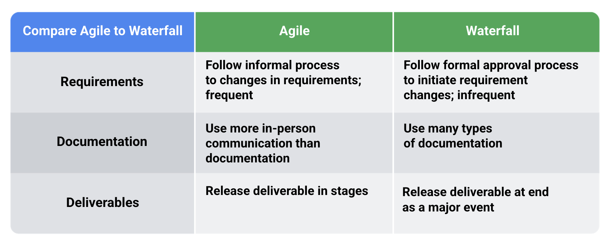

# Agile Methodology

**Agile methodology** is a project management framework that breaks projects down into several dynamic phases, commonly known as **sprints**. Here's how it works:

1. **Iterative Approach**: Agile is an **iterative** methodology. After every sprint, teams reflect and look back to see if there was anything that could be improved. They then adjust their strategy for the next sprint.

2. **Values and Principles**: The **Agile Manifesto** outlines four values and 12 principles for Agile software development. It emphasizes collaboration, working software, customer involvement, and flexibility.

   - **Values**:

     - **Individuals over processes and tools**: Agile teams prioritize collaboration and teamwork.
     - **Working software over comprehensive documentation**: Developing functional software is more important than extensive documentation.
     - **Customer collaboration over contract negotiation**: Customers guide software direction.
     - **Responding to change over following a plan**: Agile allows flexibility in shifting strategies.

   - **Principles**:
     - These principles adapt to team needs, like rooms within a house built on the Agile values.

3. **Applicability**: Agile isn't limited to software—it's successful for various teams. Whether you're in software development, marketing, or any other field, Agile can enhance collaboration and adaptability.

Remember, Agile emphasizes continuous improvement and customer involvement, making it a powerful approach for managing projects.

# Agile vs Waterfall

Let's explore the key differences between Agile and Waterfall project management methodologies:

1. **Waterfall**:

   - **Approach**: Linear and sequential.
   - **Phases**: Well-defined stages (e.g., planning, design, development, testing, deployment).
   - **Requirements**: All requirements for each phase are completed before moving to the next.
   - **Flexibility**: Less adaptable; changes are challenging once started.
   - **Use Cases**: Suited for projects with strict regulations or clear, stable requirements.

2. **Agile**:
   - **Approach**: Iterative and adaptive.
   - **Sprints**: Work divided into time-based bursts (Sprints) for rapid progress.
   - **Flexibility**: Allows changes along the way; prioritizes customer value.
   - **Self-Organizing Teams**: Agile teams allocate resources and adapt as needed.
   - **Use Cases**: Ideal for fast-moving projects, experimentation, and evolving requirements.

# Agile

Agile is a set of principles and practices for software development that emphasize flexibility, collaboration, and customer satisfaction. Its history can be traced back to the early 2000s, but its roots are even older. Here's an overview of its evolution:

## 1. **Early Influences (1950s - 1990s)**

- **Lean Manufacturing:** Developed by Toyota in the 1950s, Lean focuses on eliminating waste and improving efficiency, influencing Agile principles.
- **Iterative and Incremental Development:** Concepts like the Spiral Model (introduced by Barry Boehm in 1986) emphasized iterative cycles of development, which are central to Agile methodologies.

## 2. **The Agile Manifesto (2001)**

- In February 2001, a group of 17 software developers met in Snowbird, Utah, and created the Agile Manifesto.

### Four Values

- The Manifesto outlined four core values:
  1.  Individuals and interactions over processes and tools
  2.  Working software over comprehensive documentation
  3.  Customer collaboration over contract negotiation
  4.  Responding to change over following a plan

## Twelve Principles

- It also included 12 principles to guide Agile development, focusing on customer satisfaction, continuous delivery, and the ability to respond to changing requirements.

  1. **Customer satisfaction through early and continuous software delivery:**

     - The highest priority is to satisfy the customer through early and continuous delivery of valuable software.

  2. **Welcome changing requirements, even late in development:**

     - Agile processes harness change for the customer's competitive advantage.

  3. **Deliver working software frequently:**

     - Deliver working software frequently, from a couple of weeks to a couple of months, with a preference for the shorter timescale.

  4. **Collaboration between business stakeholders and developers:**

     - Business people and developers must work together daily throughout the project.

  5. **Support, trust, and motivate the people involved:**

     - Build projects around motivated individuals. Give them the environment and support they need, and trust them to get the job done.

  6. **Enable face-to-face interactions:**

     - The most efficient and effective method of conveying information to and within a development team is face-to-face conversation.

  7. **Working software is the primary measure of progress:**

     - Working software is the primary measure of progress.

  8. **Sustainable development, able to maintain a constant pace:**

     - Agile processes promote sustainable development. The sponsors, developers, and users should be able to maintain a constant pace indefinitely.

  9. **Continuous attention to technical excellence and good design:**

     - Continuous attention to technical excellence and good design enhances agility.

  10. **Simplicity—the art of maximizing the amount of work not done—is essential:**

      - Simplicity—the art of maximizing the amount of work not done—is essential.

  11. **Self-organizing teams:**

      - The best architectures, requirements, and designs emerge from self-organizing teams.

  12. **Regular reflections on how to become more effective:**
      - At regular intervals, the team reflects on how to become more effective, then tunes and adjusts its behavior accordingly.

These principles guide teams in implementing Agile methodologies effectively, ensuring that the focus remains on delivering high-quality software that meets customer needs and can adapt to changing requirements.

## 3. **Agile Frameworks and Methodologies**

- **Scrum:** One of the most popular Agile frameworks, Scrum emphasizes roles (Product Owner, Scrum Master, Development Team), events (Sprints, Daily Stand-ups, Sprint Reviews, Retrospectives), and artifacts (Product Backlog, Sprint Backlog, Increment).
- **Extreme Programming (XP):** Focuses on technical practices like Test-Driven Development (TDD), pair programming, and continuous integration.
- **Kanban:** Originating from Lean, Kanban visualizes work using boards and limits work in progress to improve flow and efficiency.
- **Lean Software Development:** Directly inspired by Lean manufacturing, it applies Lean principles to software development.
- **Crystal, Dynamic Systems Development Method (DSDM), Feature-Driven Development (FDD):** Other methodologies that emerged to address specific aspects of Agile development.

## 4. **Agile Adoption and Expansion (2000s - Present)**

- Agile principles spread beyond software development to other industries, including marketing, HR, and product development.
- Large-scale frameworks like SAFe (Scaled Agile Framework) and LeSS (Large Scale Scrum) emerged to help larger organizations adopt Agile practices.
- The Agile movement has continued to evolve, incorporating DevOps, Continuous Delivery, and other practices to improve the end-to-end process of delivering value to customers.

## 5. **Ongoing Evolution**

- Agile continues to adapt to new challenges and incorporate new ideas. The focus on customer-centricity, adaptability, and continuous improvement remains at the core of Agile practices.

Agile's history is marked by a continuous evolution of thought, driven by a desire to improve software development and deliver better products to customers more efficiently.

# Aspects of a project:

- Requirements
  - Conditions that must be met or tasks that must be finished to ensure the successful completion of the project.
- Documentation
- Deliverables

