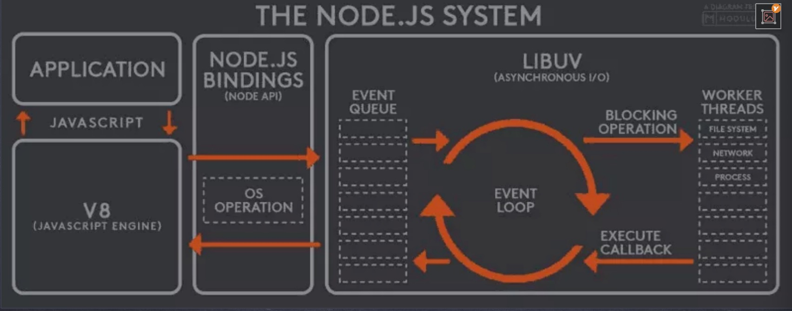

# Node JS

Node.js is an open-source, cross-platform JavaScript runtime environment that executes JavaScript code outside of a web browser. It is built on the Chrome V8 JavaScript engine and allows developers to build scalable, high-performance network applications. Here's a detailed overview of Node.js:

1. **Event-Driven Architecture**: Node.js operates on an event-driven, non-blocking I/O model, which makes it lightweight and efficient. This architecture allows Node.js to handle a large number of concurrent connections without the need for multithreading, which simplifies development and improves scalability.

2. **JavaScript**: Node.js uses JavaScript as its primary language, which allows developers to use a single programming language for both server-side and client-side development, promoting code reuse and consistency.

3. **NPM (Node Package Manager)**: Node.js comes with npm, a powerful package manager that hosts thousands of reusable packages and modules. npm simplifies dependency management, making it easy for developers to integrate third-party libraries into their projects.

4. **Asynchronous I/O**: Node.js utilizes asynchronous I/O operations, allowing it to handle multiple requests concurrently without blocking the execution thread. This asynchronous nature is essential for building highly responsive and scalable applications.

5. **Single-Threaded Event Loop**: Node.js operates on a single-threaded event loop, which efficiently manages asynchronous operations. The event loop continuously listens for events and executes callbacks when events occur, allowing Node.js to handle multiple requests without spawning additional threads.

6. **Libuv**: Node.js utilizes Libuv, a multi-platform support library with a focus on asynchronous I/O. Libuv abstracts operating system-specific functionality related to I/O operations, threading, and networking, providing a consistent interface across different platforms.

7. **Cross-Platform**: Node.js is designed to run on various operating systems, including Windows, macOS, and Linux, making it suitable for developing applications that need to be deployed across different environments.

8. **HTTP Module**: Node.js includes a built-in HTTP module that allows developers to create web servers and handle HTTP requests and responses. This module simplifies the process of building web applications and APIs.

9. **Middleware Support**: Node.js offers middleware support through frameworks like Express.js, which provides a robust set of features for building web applications, including routing, middleware, and template engines.

10. **Scalability**: Node.js is highly scalable due to its non-blocking, event-driven architecture. It can handle a large number of concurrent connections with minimal overhead, making it suitable for building real-time applications, streaming services, and microservices architectures.

11. **Community and Ecosystem**: Node.js has a vibrant and active community of developers contributing to its ecosystem. This community-driven approach has led to the development of numerous libraries, frameworks, and tools that extend Node.js's capabilities and simplify development tasks.

Overall, Node.js is a powerful and versatile runtime environment for building server-side applications and real-time web applications. Its event-driven architecture, asynchronous I/O model, and extensive ecosystem make it a popular choice for building scalable and high-performance applications.

# Node Architecture

Node.js architecture is based on a few key components that work together to provide an efficient and scalable runtime environment for JavaScript applications. Here's an overview of the architecture:



1. **V8 JavaScript Engine**: At the core of Node.js is the V8 JavaScript engine, developed by Google for the Chrome browser. V8 is responsible for executing JavaScript code and optimizing its performance. It compiles JavaScript code into machine code for faster execution and provides memory management capabilities.

2. **Libuv**: Libuv is a multi-platform support library that provides asynchronous I/O operations, event loop implementation, and cross-platform abstractions for networking, file system operations, and concurrency. It abstracts operating system-specific functionality and provides a consistent interface for handling I/O operations asynchronously.

3. **Event Loop**: Node.js operates on a single-threaded event loop, which manages asynchronous operations and callbacks. The event loop continuously checks for events, such as I/O operations or timers, and executes their associated callbacks when they are ready. This non-blocking I/O model allows Node.js to handle multiple requests concurrently without blocking the execution thread.

4. **Core Modules**: Node.js includes a set of core modules that provide essential functionality for building applications. These modules cover various areas such as file system operations (`fs`), networking (`http`, `https`, `net`), utilities (`util`), and more. Core modules are built-in and can be accessed using the `require()` function without the need for additional installation.

5. **Bindings**: Node.js allows developers to integrate C/C++ code with JavaScript using native bindings. This feature enables developers to leverage existing libraries and modules written in other languages within their Node.js applications, improving performance and extending functionality.

6. **npm (Node Package Manager)**: npm is the official package manager for Node.js and hosts a vast repository of reusable packages and modules. Developers can use npm to easily install, manage, and share dependencies for their Node.js projects. npm simplifies dependency management and promotes code reuse across projects.

7. **Bindings to External Libraries**: Node.js provides bindings to external libraries for specific functionalities, such as cryptography (`crypto`), zlib compression (`zlib`), and SSL/TLS support (`tls`). These bindings allow Node.js applications to leverage the capabilities of these libraries directly from JavaScript code.

8. **Add-on Modules and Libraries**: In addition to core modules and npm packages, Node.js ecosystem includes a wide range of add-on modules and libraries developed by the community. These modules extend Node.js's functionality and provide solutions for various use cases, including web frameworks (Express.js), database drivers (MongoDB driver, MySQL driver), and authentication middleware (Passport.js).

Overall, Node.js architecture is designed to provide a lightweight, efficient, and scalable runtime environment for building server-side applications and network services with JavaScript. Its event-driven, non-blocking I/O model, along with a rich ecosystem of modules and libraries, makes it a popular choice for developing a wide range of applications, from web servers to real-time applications and microservices.

# How non-blocking/async architecture of node makes it highly scalable ?

Node.js's non-blocking and asynchronous architecture contributes significantly to its scalability. Here's how:

1. **Concurrency without Threads**: Traditional server-side platforms like Apache HTTP Server create a new thread for each incoming request. While this approach can handle multiple concurrent connections, it's not very efficient because threads are relatively heavy in terms of memory and processing overhead. In contrast, Node.js operates on a single-threaded event loop, allowing it to handle numerous concurrent connections without the need for creating additional threads. This reduces the memory footprint and overhead associated with managing threads, making Node.js more scalable.

2. **Event-Driven Model**: Node.js uses an event-driven model where I/O operations (such as file system operations, network requests, and database queries) are non-blocking and asynchronous. When a request is made, Node.js registers a callback function and continues to process other requests without waiting for the I/O operation to complete. Once the I/O operation is finished, the callback function is executed asynchronously. This allows Node.js to handle multiple requests concurrently, maximizing throughput and responsiveness.

3. **Optimized Resource Utilization**: Since Node.js operates on a single thread, it can make more efficient use of system resources compared to multi-threaded approaches. With traditional multi-threaded servers, each thread consumes memory and CPU resources, even when it's idle. In contrast, Node.js's event loop efficiently utilizes system resources by minimizing the overhead associated with thread management and context switching.

4. **Scalability through Clustering**: While Node.js itself runs on a single thread, it can take advantage of multi-core systems by running multiple instances of Node.js processes in parallel. This is achieved using the built-in `cluster` module or by deploying Node.js applications behind a load balancer. Each Node.js process runs independently, utilizing a single thread and event loop, which allows for efficient utilization of CPU cores and improved scalability.

5. **Microservices Architecture**: Node.js's non-blocking and lightweight nature makes it well-suited for microservices architectures, where applications are composed of small, independent services that communicate via lightweight protocols such as HTTP or message queues. Each microservice can be implemented using Node.js, allowing for easy scalability by horizontally scaling individual services based on demand.

Overall, Node.js's non-blocking and asynchronous architecture enables it to handle a large number of concurrent connections efficiently, making it highly scalable for building real-time applications, web servers, microservices, and other network-intensive applications.

# NodeJS vs Browser for JS

| Feature                 | Node.js                                               | Web Browser                                                       |
| ----------------------- | ----------------------------------------------------- | ----------------------------------------------------------------- |
| Environment             | Server-side runtime environment                       | Client-side runtime environment                                   |
| I/O Operations          | Asynchronous and non-blocking                         | Asynchronous and non-blocking                                     |
| File System Access      | Full access to file system APIs                       | Limited access to file system APIs (for security)                 |
| Networking              | Built-in HTTP, HTTPS, TCP, UDP modules                | Limited networking capabilities (e.g., XMLHttpRequest, Fetch API) |
| DOM Manipulation        | Not applicable (No DOM in Node.js)                    | Full access to Document Object Model (DOM)                        |
| User Interface          | Not applicable (No UI rendering in Node.js)           | Full support for rendering HTML/CSS/JS                            |
| Event Loop              | Single-threaded, event-driven                         | Single-threaded, event-driven                                     |
| Access to Hardware APIs | Limited access (requires native bindings or modules)  | No access (for security)                                          |
| Performance             | Typically faster due to server-grade hardware         | Subject to client's hardware and browser performance              |
| Module System           | CommonJS (with support for ES modules using `import`) | ES modules (`import`/`export`)                                    |
| Package Management      | npm (Node Package Manager)                            | Not applicable (browsers do not have built-in package managers)   |
| Execution Context       | Global context, modules, functions                    | Global context, window object, DOM elements                       |
| Debugging               | Built-in debugging tools (e.g., `console`)            | Developer tools (e.g., Chrome DevTools)                           |
| Hosting Environment     | Requires server hosting (e.g., AWS, Heroku)           | Runs within the browser environment                               |
| Security                | Limited attack surface (depends on server security)   | Higher risk due to client-side execution environment              |
| Deployment              | Deployed as standalone server applications            | Deployed as web applications                                      |

This table provides a concise comparison of Node.js and web browsers, highlighting their differences in terms of environment, capabilities, performance, and use cases for JavaScript development.

# Global object in NodeJS

In Node.js, the `global` object is similar to the `window` object in web browsers, but it represents the global scope of the Node.js runtime environment. It provides access to various global properties and functions, and anything defined on the `global` object is available throughout the Node.js application.

Here are some key points about the `global` object in Node.js:

1. **Global Scope**: Variables and functions declared without the `var`, `let`, or `const` keywords are implicitly added to the `global` object in Node.js, making them accessible from anywhere within the application.

2. **Global Properties and Functions**: The `global` object provides access to several built-in properties and functions, including:

   - `global.console`: Provides methods for logging messages to the console.
   - `global.process`: Represents the Node.js process and provides information about the current process, environment variables, and command-line arguments.
   - `global.Buffer`: Represents raw binary data similar to an array of integers but corresponds to a raw memory allocation outside the V8 heap.
   - `global.setTimeout()`, `global.clearTimeout()`, `global.setInterval()`, `global.clearInterval()`: Functions for scheduling timers.
   - `global.require()`: Function to import modules in Node.js.

3. **Global Variables**: Some variables are automatically defined on the `global` object, such as `__dirname` (the directory name of the current module), `__filename` (the filename of the current module), and `process` (the Node.js process object).

4. **Modifiability**: While the `global` object provides a convenient way to access global variables and functions, it's generally recommended to avoid polluting the global namespace in large-scale applications to prevent naming conflicts and improve code maintainability.

Here's a simple example demonstrating the use of the `global` object in Node.js:

```javascript
// Accessing global properties
console.log(global.console === console); // true
console.log(global.process === process); // true

// Defining a global variable
global.myGlobalVariable = "Hello, global world!";

// Accessing the global variable from another module
// In another file/module
console.log(global.myGlobalVariable); // Hello, global world!
```

While the `global` object provides access to global variables and functions, it's important to use it judiciously and consider modularization and encapsulation practices for better code organization and maintainability in Node.js applications.

# Modules in NodeJS

In Node.js, a module is a reusable block of code encapsulated in a file. Each file in a Node.js application is treated as a separate module, and the code within the file is scoped to that module. This modular approach promotes code organization, reusability, and maintainability.

1. **Module Definition**:

   - A module in Node.js is defined by a JavaScript file. By default, the code within a file is scoped to that module, meaning variables, functions, and classes defined in one module are not accessible outside unless explicitly exported.

2. **Module Scope**:

   - **Local Scope**: Variables, functions, and classes defined within a module are local to that module by default. They are not accessible outside the module unless explicitly exported.
   - **Global Scope**: While each module has its own scope, there are certain objects and variables that are accessible globally within the Node.js runtime, such as `global` object, `require()` function, and some built-in modules like `process`.

3. **Exports**:

   - To make variables, functions, or objects defined in a module accessible to other modules, they need to be explicitly exported using the `module.exports` or `exports` object.
   - The `module.exports` object is used to export a single value (usually an object, function, or class), while the `exports` object is a shorthand for `module.exports` and is commonly used to export multiple values.
   - For example, in a file named `myModule.js`:

     ```javascript
     // Exporting a single function
     function greet(name) {
       return `Hello, ${name}!`;
     }
     module.exports = greet;

     // Exporting multiple values
     exports.sayHello = function (name) {
       return `Hello, ${name}!`;
     };
     ```

4. **Importing Modules**:

   - To use functionality exported from other modules, you need to import them using the `require()` function.
   - When a module is required, Node.js loads the module and executes its code, returning the exported values.
   - For example, in another file/module:

     ```javascript
     // Importing a single function
     const greet = require("./myModule");
     console.log(greet("John")); // Output: Hello, John!

     // Importing multiple values
     const { sayHello } = require("./myModule");
     console.log(sayHello("Alice")); // Output: Hello, Alice!
     ```

5. **Core Modules**:
   - Node.js provides a set of core modules, such as `fs`, `http`, and `util`, which are available globally without the need for explicit installation.
   - Core modules can be imported using the `require()` function like any other module.
   - For example:
     ```javascript
     const fs = require("fs");
     const http = require("http");
     ```

By using modules and module scope in Node.js, developers can create modular, maintainable, and scalable applications by breaking down code into smaller, reusable units and encapsulating functionality within well-defined boundaries. This promotes code reusability, readability, and easier maintenance.

## CommonJS Export and Import

### Exporting Modules in Node.js

In Node.js, each file is considered a **module**. Variables, functions, and classes within a module are private to that specific file. If you want to use them outside of the module, you need to **export** them. Here's how it works:

1. **CommonJS Modules** (the original approach in Node.js):

   - Node.js includes a special object called `module.exports` or simply `exports`.
   - The `module` variable represents the current module, and `exports` is an object that will be exposed as a module.
   - Whatever you assign to `module.exports` or `exports` becomes accessible for other parts of your application.

2. **Example: Exporting a Function**
   Suppose you have a utility file named `utility.js` with the following code:

   ```javascript
   // utility.js
   const replaceStr = (str, char, replacer) => {
     const regex = new RegExp(char, "g");
     const replaced = str.replace(regex, replacer);
     return replaced;
   };

   // Export the function
   module.exports = {
     replaceStr,
   };
   ```

   Now, the `replaceStr` function is available for use in other parts of your application. To use it, you can import it like this:

   ```javascript
   const { replaceStr } = require("./utility.js");
   // Now you can use the function anywhere
   ```

3. **Difference Between `module.exports` and `exports`**
   - Both `module.exports` and `exports` can be used to export functions and values from a module.
   - You can assign properties directly to `exports`, like `exports.myFunction = ...`.
   - However, if you want to replace the entire exports object, use `module.exports`.

### Importing Modules in Node.js

To import a module, use the `require` keyword. For example:

```javascript
const myModule = require("./myModule.js");
// Now you can use functions and values from myModule
```

## ECMAScript Modules - Export and Import

### Exporting Modules in ES Modules (ESM)

ES Modules are the official standard format for packaging JavaScript code for reuse. They allow you to organize your code into separate files and share functionality across different parts of your application. Here's how exporting works:

1. **Exporting Named Members**:

   - In an ES module, you can export specific members (variables, functions, classes) using the `export` keyword.
   - For example, consider a file named `math.js` with the following content:

   ```javascript
   // math.js
   export const add = (a, b) => a + b;
   export const subtract = (a, b) => a - b;
   ```

   Now, both the `add` and `subtract` functions are available for import in other files.

2. **Exporting with Aliases**:

   - You can also give aliases to exported members using the `as` keyword.
   - For instance:

   ```javascript
   // math.js
   export { add as sum, subtract };
   ```

   Now you can import them with different names:

   ```javascript
   import { sum, subtract } from "./math.js";
   ```

3. **Default Export**:

   - ES modules allow defining a default export using the `default` keyword.
   - Example:

   ```javascript
   // logger.js
   const logMessage = (message) => {
     console.log(`[INFO] ${message}`);
   };

   export default logMessage;
   ```

   You can import the default export like this:

   ```javascript
   import logger from "./logger.js";
   ```

### Importing Modules in ES Modules

Importing is straightforward using the `import` keyword:

```javascript
import { add, subtract } from "./math.js";
```

You can also import everything from a module using the wildcard `*`:

```javascript
import * as utils from "./math.js";
utils.add(10, 5); // Use the add function
```

Remember that ES modules are widely supported in modern JavaScript environments. If you're using Node.js, make sure to use the `.mjs` extension for ES modules (e.g., `math.mjs`).

# Module Wrapper Function

### What is the Module Wrapper Function?

Before a module's code is executed in Node.js, it is wrapped with a special function called the **module wrapper function**. This wrapper function looks like the following:

```javascript
(function (exports, require, module, __filename, __dirname) {
  // Module code actually lives in here
});
```

Here's what the module wrapper function achieves:

1. **Scoping Variables to the Module**:

   - The module wrapper function ensures that top-level variables (defined with `var`, `const`, or `let`) are scoped to the module itself, rather than the global object.
   - This prevents unintended global pollution and keeps your module-specific variables isolated.

2. **Module-Specific Variables**:

   - The wrapper provides several module-specific variables:
     - `exports`: An object that allows you to export values from the module.
     - `require`: A function to load other modules.
     - `module`: An object representing the current module.
     - `__filename`: The absolute filename of the module.
     - `__dirname`: The directory path of the module.
   - These variables are unique to each module and help organize and encapsulate your code.

3. **Configuring Your Module**:
   - Essentially, the module wrapper function is used to configure your module before its code is executed.
   - It sets up the necessary context for your module to function correctly.

### Process and Global Variables

You mentioned the **process** and **global** variables. Let's briefly cover them:

- **`process` Object**:

  - The `process` object provides information about and control over the current Node.js process.
  - It emits events (e.g., `exit`, `uncaughtException`) and includes functions like `process.abort()` to terminate the process.
  - Refer to the [Node.js documentation on `process`](https://nodejs.org/api/process.html) for more details.

- **`global` Object**:
  - The `global` object allows access to global variables across different modules.
  - For example, if you set `global.something = true` in one module, you can access `something` without exporting it in another module.
  - Read more about the [Node.js global object](https://nodejs.org/api/globals.html).

### Customizing the Wrapper

You can even customize the module wrapper function if needed. For instance, you can modify it like this:

```javascript
let Module = require("module");
Module.wrap = function (exports, require, module, __filename, __dirname) {
  // Your custom wrapper logic here
  return (
    Module.wrapper[0] +
    exports +
    'console.log("This is the wrapper.");' +
    Module.wrapper[1]
  );
};
```

# Built-In NodeJS Modules

**Node.js** comes with a set of built-in modules that you can use without any additional installation. These modules provide essential functionality for various tasks. Let's explore some of the most commonly used built-in modules:

1. **File System (fs)**:

   - The `fs` module allows you to manipulate files and directories.
   - You can create, read, write, and delete files, as well as manage directories.
   - Example usage:
     ```javascript
     const fs = require("fs");
     fs.readFile("myfile.txt", "utf8", (err, data) => {
       if (err) throw err;
       console.log(data);
     });
     ```

2. **Path (path)**:

   - The `path` module provides utilities to work with file and directory paths.
   - It handles path normalization, joining, and extracting components like directory names and file extensions.
   - Example usage:
     ```javascript
     const path = require("path");
     const fullPath = path.join(__dirname, "mydir", "myfile.txt");
     ```

3. **HTTP (http)**:

   - The `http` module allows you to create HTTP servers and clients.
   - You can build web servers, handle requests, and send HTTP requests to other servers.
   - Example usage:
     ```javascript
     const http = require("http");
     const server = http.createServer((req, res) => {
       res.writeHead(200, { "Content-Type": "text/plain" });
       res.end("Hello, World!");
     });
     server.listen(8080);
     ```

4. **Events (events)**:

   - The `events` module enables handling and emitting events within your application.
   - You can create custom event emitters and listen for events.
   - Example usage:
     ```javascript
     const EventEmitter = require("events");
     const myEmitter = new EventEmitter();
     myEmitter.on("customEvent", (arg) => {
       console.log("Custom event occurred:", arg);
     });
     myEmitter.emit("customEvent", "Hello from Node.js!");
     ```

5. **Stream (stream)**:
   - The `stream` module provides a way to handle streaming data.
   - You can read from or write to streams, which are especially useful for large files or network communication.
   - Example usage:
     ```javascript
     const fs = require("fs");
     const readStream = fs.createReadStream("largefile.txt");
     readStream.pipe(process.stdout);
     ```

These built-in modules are fundamental to Node.js development. Remember to explore the official Node.js documentation for more details and additional modules.

## Path Module

The **Path module** in **Node.js** is a powerful utility that simplifies working with file and directory paths. It provides consistent and cross-platform methods for manipulating, creating, and joining file paths. Let's explore its key features:

1. **Importing the Path Module**:

   - To use the Path module, you can include it in your Node.js application using the following syntax:

   ```javascript
   const path = require("path");
   ```

2. **Commonly Used Methods and Properties**:

   - `path.basename(path[, suffix])`: Returns the last portion of a path (the filename) after removing the directory.
   - `path.delimiter`: A platform-specific path delimiter (e.g., `:` on Unix, `;` on Windows) used in environment variables.
   - `path.dirname(path)`: Returns the directory name of a path.
   - `path.extname(path)`: Returns the file extension (including the dot) from a path.
   - `path.format(pathObject)`: Creates a path string from an object with properties like `dir`, `base`, `root`, etc.
   - `path.isAbsolute(path)`: Checks if a path is an absolute path.
   - `path.join([...paths])`: Joins path segments into a single path.
   - `path.normalize(path)`: Normalizes a path by resolving `.` and `..` segments.
   - `path.parse(path)`: Parses a path into an object with properties like `root`, `dir`, `base`, etc.
   - `path.relative(from, to)`: Calculates the relative path from one path to another.
   - `path.resolve([...paths])`: Resolves an absolute path from given path segments.
   - `path.sep`: A platform-specific path segment separator (e.g., `/` on Unix, `\` on Windows).
   - `path.toNamespacedPath(path)`: Converts a path to a namespace-prefixed path (Windows only).
   - `path.win32`: Provides Windows-specific path methods.
   - `path.posix`: Provides POSIX-specific path methods.

3. **Example Usage**:
   Suppose you have the following code:

   ```javascript
   const filePath = "/home/user/documents/report.txt";

   console.log("File name:", path.basename(filePath));
   console.log("Directory:", path.dirname(filePath));
   console.log("Extension:", path.extname(filePath));
   console.log("Normalized path:", path.normalize(filePath));
   ```

   Output:

   ```
   File name: report.txt
   Directory: /home/user/documents
   Extension: .txt
   Normalized path: /home/user/documents/report.txt
   ```

4. **Cross-Platform Compatibility**:
   - The Path module ensures that your code works consistently across different operating systems (Windows, Unix, macOS).
   - It abstracts away platform-specific differences in path handling.

Remember to explore the Path module's documentation for more details and additional methods.

## OS Module

The **OS module** in **Node.js** provides essential information about the computer's operating system. It allows developers to interact with the underlying OS on which their Node.js application runs. Here are some key features and functions provided by the OS module:

1. **Architecture**:

   - The `os.arch()` function returns the CPU architecture for which the Node.js binary was compiled.
   - Possible values include `'arm'`, `'arm64'`, `'ia32'`, `'loong64'`, `'mips'`, `'mipsel'`, `'ppc'`, `'ppc64'`, `'riscv64'`, `'s390'`, `'s390x'`, and `'x64'`.

2. **Operating System Constants**:

   - The OS module defines various constants related to signals, errors, and other system-specific properties.
   - For example:
     - `SIGHUP`: Sent when a controlling terminal is closed or a parent process exits.
     - `SIGINT`: Sent when a user interrupts a process (usually via Ctrl + C).
     - `SIGTERM`: Sent to request termination of a process.
     - ...and many more.

3. **Other Useful Functions**:
   - `os.hostname()`: Returns the hostname of the operating system.
   - `os.freemem()`: Returns the amount of free system memory in bytes.
   - `os.totalmem()`: Returns the total system memory in bytes.
   - `os.platform()`: Returns the operating system platform (e.g., `'win32'`, `'linux'`, `'darwin'`).
   - `os.release()`: Returns the operating system release version.
   - `os.type()`: Returns the operating system type (e.g., `'Linux'`, `'Windows_NT'`).

Remember, the OS module helps you retrieve crucial information about the environment in which your Node.js application is running.

## FileSystem Module

The **File System (fs) module** in **Node.js** is a core module that provides powerful utilities for interacting with files and directories. Let's explore its key features:

1. **Importing the File System Module**:

   - To use the File System module, simply include it in your Node.js application using the following line at the top of your file:
     ```javascript
     const fs = require("fs");
     ```

2. **Commonly Used Functions**:

   - The fs module provides various functions for file manipulation:
     - `fs.readFile(path, options, callback)`: Read the contents of a file asynchronously.
     - `fs.writeFile(file, data, options, callback)`: Write data to a file asynchronously.
     - `fs.readdir(path, options, callback)`: Read the contents of a directory asynchronously.
     - `fs.stat(path, callback)`: Get information about a file or directory asynchronously.
     - ...and many more.

3. **Example Usage**:

   - Suppose you want to read the contents of a file named `myfile.txt`:
     ```javascript
     fs.readFile("myfile.txt", "utf8", (err, data) => {
       if (err) throw err;
       console.log(data);
     });
     ```

4. **Synchronous vs. Asynchronous**:

   - Most fs functions have both synchronous and asynchronous versions.
   - Asynchronous functions use callbacks, while synchronous functions block the event loop until the operation completes.
   - It's generally recommended to use asynchronous functions to avoid blocking the event loop.

5. **Error Handling**:
   - Always handle errors properly when working with fs functions.
   - Use try-catch blocks for synchronous operations and error-first callbacks for asynchronous operations.

Remember to explore the official Node.js documentation for more details and additional methods provided by the fs module!

Always prefer asynchronous methods over synchronous as it takes away the advantage of non blocking node architecture.

## Events Module:

The **Events module** in Node.js is a powerful tool for creating and handling custom events. It's an essential part of the Node.js core API, allowing you to build event-driven architectures. Here's how it works:

1. **EventEmitter Class**:

   - All objects that emit events are instances of the `EventEmitter` class.
   - These objects can emit named events, and functions (called "listeners") can be attached to these events.
   - Event names are typically camel-cased strings, but any valid JavaScript property key can be used.

2. **Registering and Triggering Events**:

   - Use the `eventEmitter.on()` method to register listeners for specific events.
   - When an event occurs, all attached listeners are called synchronously.
   - The `eventEmitter.emit()` method triggers the event and invokes the associated listeners.

3. **Example Usage**:

   ```javascript
   const { EventEmitter } = require("events");

   class MyEmitter extends EventEmitter {}

   const myEmitter = new MyEmitter();

   myEmitter.on("event", () => {
     console.log("An event occurred!");
   });

   myEmitter.emit("event");
   ```

4. **Passing Arguments and `this` to Listeners**:

   - You can pass arguments to listener functions using `eventEmitter.emit()`.
   - The standard `this` keyword inside a listener refers to the `EventEmitter` instance to which the listener is attached.
   - Arrow functions as listeners lose the reference to `this`.

5. **ES6 Arrow Functions and `this`**:
   - When using arrow functions as listeners, `this` no longer refers to the `EventEmitter` instance:
     ```javascript
     myEmitter.on("event", (a, b) => {
       console.log(a, b, this); // Prints: a b undefined
     });
     ```

The Events module allows you to create a robust event-driven architecture in your Node.js applications. Explore its capabilities and build reactive systems

### Extending EventEmitter

Let's create a class that extends `EventEmitter` so that we can emit events and listen to them from different modules. We'll use TypeScript for this example.

1. First, install the `@types/node` package if you haven't already (for TypeScript type definitions):

   ```bash
   npm install @types/node
   ```

2. Create a TypeScript file (e.g., `MyClass.ts`) with the following content:

   ```typescript
   import { EventEmitter } from "events";

   // Define the event listener signatures
   interface MyClassEvents {
     hello: (name: string) => void;
     // Add more events if needed
   }

   // Declare the interface for MyClass
   declare interface MyClass {
     on<U extends keyof MyClassEvents>(
       event: U,
       listener: MyClassEvents[U]
     ): this;
     emit<U extends keyof MyClassEvents>(
       event: U,
       ...args: Parameters<MyClassEvents[U]>
     ): boolean;
   }
   // Let's break down each of these TypeScript constructs:

   // 1. **`U`**:
   //    - `U` is a generic type parameter. In TypeScript, generics allow you to create reusable components that work with a variety of types.
   //    - In the context of the `MyClass` interface, `U` represents the event name. It's a placeholder for a specific event name that will be provided when using the `on` and `emit` methods.

   // 2. **`keyof MyClassEvents`**:
   //    - `keyof` is a TypeScript operator that produces a union type of all the property names (keys) of a given type.
   //    - In this case, `keyof MyClassEvents` produces a union type containing all the event names defined in the `MyClassEvents` interface. It ensures that `U` can only be one of these event names.

   // 3. **`MyClassEvents[U]`**:
   //    - `MyClassEvents[U]` is an indexed access type. It allows you to retrieve the type associated with a specific property (in this case, an event name) of a given type (in this case, `MyClassEvents`).
   //    - Since `MyClassEvents` is an interface defining event signatures, `MyClassEvents[U]` represents the type of the callback function associated with the event name `U`. It's essentially the type of the event handler function.

   // 4. **`...args: Parameters<MyClassEvents[U]>`**:
   //    - `Parameters<>` is a TypeScript utility type that extracts the parameter types of a function type as a tuple type.
   //    - `Parameters<MyClassEvents[U]>` retrieves the parameter types of the callback function associated with the event name `U` in `MyClassEvents`. It ensures that the arguments passed to the `emit` method match the expected parameters of the event handler function for the specified event.

   // In summary, `U` represents the event name, `keyof MyClassEvents` ensures that `U` can only be one of the defined event names, `MyClassEvents[U]` retrieves the type of the callback function associated with the event name `U`, and `Parameters<MyClassEvents[U]>` extracts the parameter types of that callback function. Together, they provide type safety and ensure that event handling is consistent and error-free in TypeScript.

   // Create the MyClass class extending EventEmitter
   class MyClass extends EventEmitter {
     emitHello(name: string): void {
       this.emit("hello", name);
     }
   }

   // Export the class instance
   export default MyClass;
   ```

3. Now you can use `myClassInstance` in other modules to emit and listen to events:

   ```typescript
   // In another module (e.g., main.ts)
   import MyClass from "./MyClass";
   const myClassInstance = new MyClass();
   myClassInstance.on("hello", (name) => {
     console.log(`Hello, ${name}!`);
   });

   myClassInstance.emitHello("Alice"); // Emits the 'hello' event
   ```

4. Compile your TypeScript code using `tsc` or your preferred TypeScript build tool.

5. Run your compiled JavaScript code (e.g., `node main.js`).

This way, you can create an instance of `MyClass` in one module, emit events from it, and listen to those events in other modules. 

## HTTP Module

The **HTTP module** in **Node.js** is a powerful tool for handling HTTP requests and responses. It allows you to create **web servers**, make **HTTP requests**, and manage various aspects of the HTTP protocol. Let's dive into the details:

1. **Creating an HTTP Server**:
   - To use the HTTP server in Node.js, you need to **require** the `http` module. Here's how you can do it:
     ```javascript
     const http = require('http');
     ```
   - Once you've required the module, you can create an HTTP server that listens to specific **ports** and responds to client requests.

2. **HTTP Server Features**:
   - The `http` module provides classes and events for both **server-side** and **client-side** interactions.
   - Key classes include:
     - `http.Server`: Represents an HTTP server.
     - `http.ClientRequest`: Represents an outgoing HTTP request.
     - `http.IncomingMessage`: Represents an incoming HTTP request.
     - `http.ServerResponse`: Represents an outgoing HTTP response.

3. **Server-Side Events**:
   - The `http.Server` emits various events, such as:
     - `'request'`: Triggered when a client sends an HTTP request.
     - `'close'`: Fired when the server closes.
     - `'upgrade'`: Raised when an upgrade request is received (e.g., WebSocket upgrade).

4. **Client-Side Events**:
   - The `http.ClientRequest` emits events like:
     - `'response'`: Fired when the server responds to the request.
     - `'error'`: Triggered if an error occurs during the request.
     - `'connect'`: Raised when a connection is established.

5. **Common Methods**:
   - For server-side requests, you can use methods like:
     - `request.on('data', callback)`: Handles incoming data.
     - `request.end([data[, encoding]][, callback])`: Sends the response data.
   - For client-side requests:
     - `http.get(options, callback)`: Makes an HTTP GET request.
     - `http.request(options, callback)`: Creates a custom HTTP request.

6. **Example Usage**:
   - Here's a simple example of creating an HTTP server:
     ```javascript
     const http = require('http');

     const server = http.createServer((req, res) => {
       res.writeHead(200, { 'Content-Type': 'text/plain' });
       res.end('Hello, world!\n');
     });

     server.listen(8080, () => {
       console.log('Server listening on port 8080');
     });
     ```
   - In this example, the server responds with "Hello, world!" when accessed.

Remember, the `http` module is a fundamental part of Node.js for handling web-related tasks. Whether you're building APIs, serving web pages, or making HTTP requests, the `http` module has got you covered! 


# Installing Node

1. **Windows**:

   - [Download the **Windows Installer** for Node.js from the official website](https://nodejs.org/en/download) .
   - Run the installer and follow the installation process.
   - Verify the installation by opening a command prompt and typing `node -v`.

2. **macOS**:

   - [Download the **macOS Installer (.pkg)** from the official website](https://nodejs.org/en/download) .
   - Run the installer and follow the installation process.
   - Verify the installation by opening a terminal and typing `node -v`.

3. **Linux (Ubuntu 22.04)**:

   - Open a terminal and run the following commands:
     ```
     sudo apt update
     sudo apt install nodejs
     ```
   - Press `Y` when prompted to confirm the installation.
   - Verify the installation by typing `node -v`.

4. **Other Linux Distributions**:
   - Refer to the official Node.js documentation for installation instructions .

Remember to check the Node.js version after installation using `node -v`.
